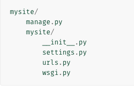
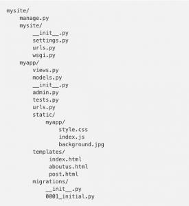
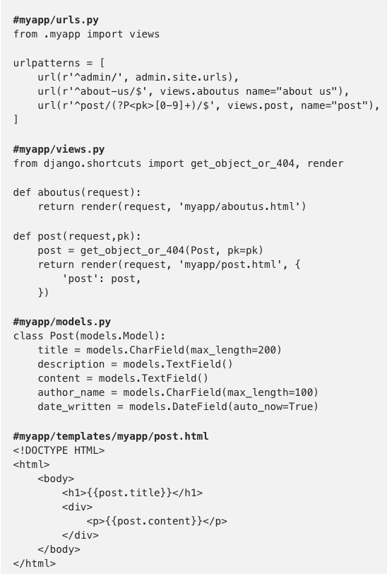

Django is a full stack python web framework for web development. I have been working with Django from 2016 and it's my first ever framework that I had learned back then. It is a wonderful framework that provides some of the out of box features for rapid web development.

## Architecture of Django

Django follows MTV ( Model Template View ) Which is a MVC architecture.

The `Model` is the logical data structure behind the entire application and is represented by a database usually a relational database such as MySql and Postgres.

The `View` is the user interface that is usually HTML CSS and JS, if web services are used it can be a REST or a SOAP endpoint that is consumed by the UI.

The `Controller` is the one that connects the Model and the View. Some data manipulation and processing can happen in the  controller.

Suppose a user enters a particular url in the browser the Django application will process the urls in the routes file when a match is found in the urls file it calls the respective controller and does the processing and renders the UI. Suppose a match is not found then the application will throw an error or it will load the default view that is been configured.

When you create a Django application with the command `django-admin startproject mysite` the Django application will be created with the following structure.

## The files specification is explained well in the Django docs.

1. The outer directory `mysite/` is the outer container to your project. Your are free to name it whatever you like.
2. `manage.py` is a utility that contains few command that lets you interact with the Django server. You can read all the details about `manage.py` in [django-admin and manage.py](https://docs.djangoproject.com/en/2.1/ref/django-admin/).
3. The inner `mysite/` is the actual python package for your project.
4. `mysite/__init__.py` is the file that is used to initial all the function of the package. It tells the Python that the directory should be used as a package. This feature allows us to make a package out of a the current application and can be used in other systems. You can read [more about packages](https://docs.python.org/3/tutorial/modules.html#tut-packages) in the official Python docs.
5. `mysite/settings.py` consists all the settings for the Django application. [Django settings](https://docs.djangoproject.com/en/2.1/topics/settings/) will tell you all about how settings work.
6. `mysite/urls.py:` The URL declarations is a list that contains the url of the application linked to the controller  that performs some operations and renders the required data to the view. You can read more about URLs in [URL dispatcher](https://docs.djangoproject.com/en/2.1/topics/http/urls/).
7. `mysite/wsgi.py:` This file is the entry point for various web servers that are WSGI-compatible. See [How to deploy with WSGI](https://docs.djangoproject.com/en/2.1/howto/deployment/wsgi/) for more details.

Now create an app inside the Django app with the help of the command `python manage.py startapp myapp` this will create a app inside the Django application. Every Django application will consist of atlas one app. This application can be attached and detached from the system at any point of time and can be sued as a plugin for another application. Hence the apps created with Django behaves as a microservice that can be used for a specific purpose.

## The created app folder structure is as follows.

1. `myapp/models.py` is the Model, or where you define your database.
2. `myapp/views.py` is the controller. You may wonder why the controller is called view. Django [docs](https://docs.djangoproject.com/en/1.11/faq/general/#django-appears-to-be-a-mvc-framework-but-you-call-the-controller-the-view-and-the-view-the-template-how-come-you-don-t-use-the-standard-names) has a very good explanation for this.
3. Everything under `myapp/templates/myapp/` are HTML files that define the view. Suppose you want to display the data from the controller you can pass objects such as a list.
4. `urls.py` will contain the list of urls for the app.

--
**The reason why Django is loved by many developers.**

1. **Easy to learn since Python is the base language** Django is easy to learn and get started. A developer who has fundamental basics of python can easily pick up Django within no time. I like Django because of its simplicity of how it is built. With just a few lines of code you can do a lot.

2. **Provides out of the box features** Django provides some out of the box features for developing monolithic application. Django comes with an in built admin panel which can be used to generate CRUD operations. The admin panel can also reduce some problems and make our life easy. The active admin is completely customizable to any extent. Django comes with Django forms for form related features. Django Rest Framework makes it easy to build REST api’s with minimal effort.

3. **Rapid development** With Django you can do development with lightning speed at the same time keep the code base clean. Django takes care of most of the security issues and common security mistakes developers make while developing application.

4. **Community support** Django has a very good community support and lot of open source developers contribute to the code base every now and then currently Django 2.1.4 is the latest stable release as of Jan 3rd 2019 which makes use of Python3. Django also has a very good and awesome documentation which makes a developer life easy.

5. **Lots of library can be found over the web** PIP is the widely used package manager for python and it contains tons of libraries for python development which can be used as per your need. Lots of Artificial Intelligence, Machine Learning libraries are implemented in python. The widely used Machine learning library Tensorflow is also available in python.

6. **If your application is data intensive Django is the solution** Since Django is a python based framework it becomes very easy to introduce analytic solution. As discussed earlier we can integrate lot of AI and ML libraries to a python system. Which lowers the pain of building external API’s to connect to your system.