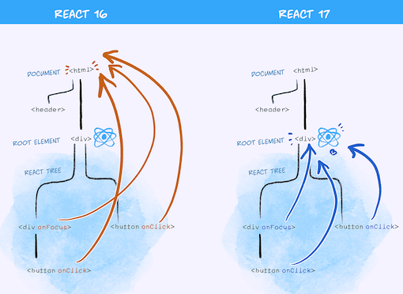

On 20th October the new version of React was released which was a major release for ReactJS after two long years. But surprisingly there were no major developer features that were introduced in this release, rather features related to backward compatibility were introduced to make it easier to upgrade React.

## Why no new features in React 17 ?

The new version of React doesn't add any new developer features to it rather it focuses on adding backward compatibility with old versions of react. React 17 will serve as the bridge between the older and upcoming versions of ReactJS. The team is working on the new features like concurrent mode but they are not a part of this release.

React 17 allows multiple versions of React to be embedded inside the DOM tree. This is one of the major benifits of React 17.

## Gradual React Upgrades

With React 17 you can do gradual React updates. You can update the entire app from the older version to the new version completely or part by part.

React 17 provides two options to upgrade your app to the next version of React, say React 18. Either you can upgrade your entire app at once or migrate your app piece by piece.

## How is it possible to embed different versions of react with React 17 ?

In React 17 changes have been made to event delegation. It was possible even before to embed multiple versions of React inside a DOM tree but it was a very delicate move considering how the React event system worked.

In React we write a click event like:

```javascript

    <button onClick={handleClick}>

```

This event does not attach itself to the document node on which it is written rather it attaches itself to the document root in React 16 and previous versions of React. In React 17 the event is attached to the root dom container in which your tree is rendered. 

```javascript

    const rootNode = document.getElementById('root');
    ReactDOM.render(<App />, rootNode);

```

The below diagram shows us how the event progation works in React 16 vs React 17.



This is why we can nest muliple versions of React in React 17.

## Major Changelog in React 17

### The new JSX transform

With the new React 17 you don't need to import React while writing a React component.

```javascript

const MyComponent = ()=> (
    <div>"some text man"</div>
)

```

The above code will turn into 

```javascript

import { jsx as _jsx } from "react/jsx-runtime";

function MyComponent() {
  return _jsx("div", `"some text man"`);
}

```

The react team has worked closely with the babel developers to introduce this feature. There is a chance that this feature may reduce the bundle size according to the react docs.

## React DOM Changelog

### Delegate events to the root instead of the document

Prior to React 17 the events were delegated to the document rather than to the root. This had created several issues mostly with embedding different versions of React into an application. With React 17 the events are delegated to the root. This helps us embed multiple versions of React into the application. 

### Clean up all effects before running any new effects

Previously we only flushed destroy functions for a single fiber. The reason this is important is because the destroy function in one component can interfere with the ref value of another component.

the above are few changes probably I liked there are other changes noted on their official website. You can check it [here](`https://reactjs.org/blog/2020/10/20/react-v17.html`).
